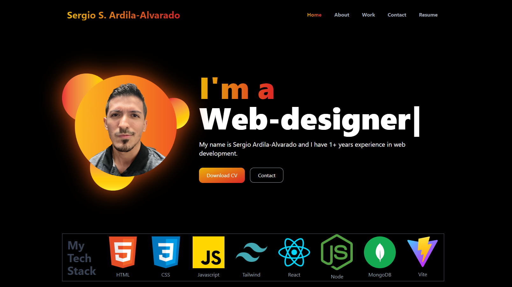
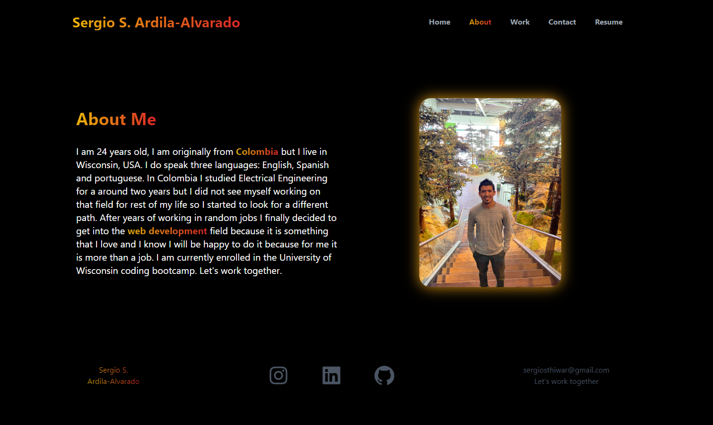

# My Portfolio
 
 
 

## Description  :bookmark_tabs:

Creating this project was really important for me because it allowed me to apply and consolidate the web design skills I've been honing over the past few months. One of my primary motivations for creating this project was to develop a polished portfolio to showcase when applying for jobs. 

I dedicated a good amount of time and effort to ensure that my portfolio not only looks appealing but also effectively represents my skills and achievements. Within the portfolio, I've highlighted various projects that I made during my bootcamp, offering a comprehensive view of my work. One of the most important aspects of this project was mastering the integration of React and Tailwind CSS. This combination allowed me to create a dynamic and visually appealing website. Additionally, I successfully deployed my portfolio to Netlify which helped me to expand my knowledge of deployment techniques.

## Installation :computer:

You can check My Portfolio here:

[![Button Example]](https://sergio-ardila-portfolio.netlify.app/)
<!----------------------------------------------------------------------------->
[Link]: # 'Link with example title.'
<!---------------------------------[ Buttons ]--------------------------------->
[Button Example]: https://img.shields.io/badge/Click%20me%20-%23F59120?style=for-the-badge

## Usage :bar_chart:
If you are unable to open the URL, I attached a screenshot of it below, so you have an idea of how it looks like:
    
    ---
    
    ---
    
As you can see, there is a little menu on the top-right of the website, so you can click any of them and it will take you to the respective section. You can read a little bit about me under the "About" section. If you go to my work, you can click on some of the projects I have done and it will take you to either the deployed application or to my GitHub, you can also download my resume on the main page or in the "Resume" section. In adittion to that, you can contact me and I will reach out to you!

## Credits :email:

 - Adobe Photoshop
 - Adobe Illustrator
 - https://www.npmjs.com/package/react-type-animation
 - https://tailwindcss.com/docs/
 - https://www.youtube.com/watch?v=IPEqb_AJbAQ

## License :memo:
---
---
MIT License

Copyright (c) 2023 Sergio S. Ardila-Alvarado

Permission is hereby granted, free of charge, to any person obtaining a copy
of this software and associated documentation files (the "Software"), to deal
in the Software without restriction, including without limitation the rights
to use, copy, modify, merge, publish, distribute, sublicense, and/or sell
copies of the Software, and to permit persons to whom the Software is
furnished to do so, subject to the following conditions:

The above copyright notice and this permission notice shall be included in all
copies or substantial portions of the Software.

THE SOFTWARE IS PROVIDED "AS IS", WITHOUT WARRANTY OF ANY KIND, EXPRESS OR
IMPLIED, INCLUDING BUT NOT LIMITED TO THE WARRANTIES OF MERCHANTABILITY,
FITNESS FOR A PARTICULAR PURPOSE AND NONINFRINGEMENT. IN NO EVENT SHALL THE
AUTHORS OR COPYRIGHT HOLDERS BE LIABLE FOR ANY CLAIM, DAMAGES OR OTHER
LIABILITY, WHETHER IN AN ACTION OF CONTRACT, TORT OR OTHERWISE, ARISING FROM,
OUT OF OR IN CONNECTION WITH THE SOFTWARE OR THE USE OR OTHER DEALINGS IN THE
SOFTWARE.

---
---

